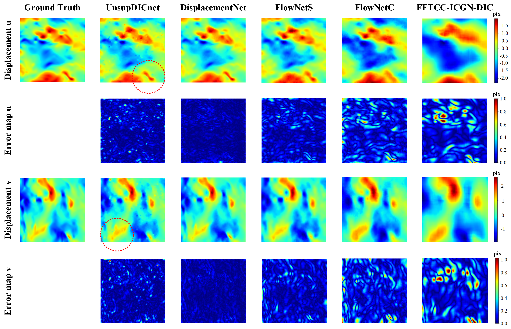
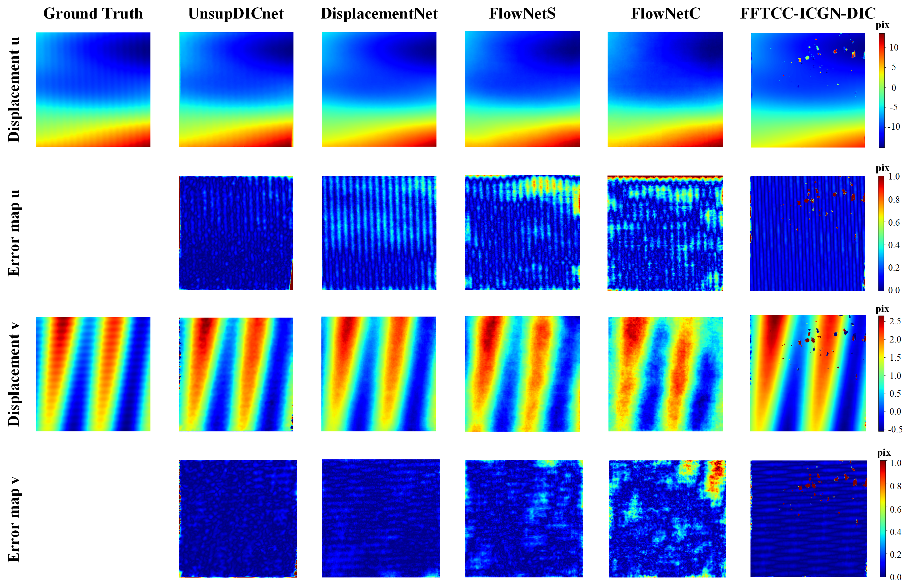
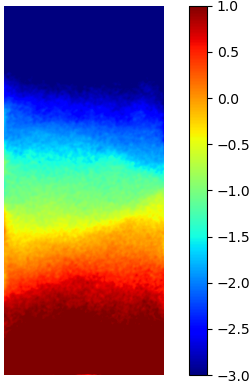
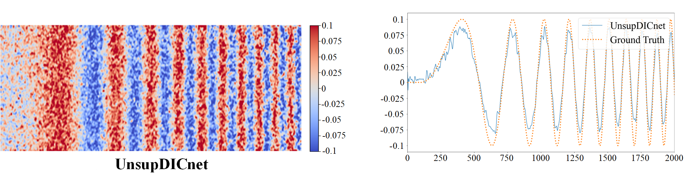

# UnsupDICnet
An unsupervised learning based DIC method (一种无监督DIC方法)
# Introduction
Pytorch implementation of an unsupervised learning based DIC method.  
The code provides three prediction examples, the imgs are from a public dataset, a self-built dataset and DIC challenge 1.0.  
The six kinds of weights for public dataset and the weight for self-built dataset are provided.
The self-builtdataset is provided for your own further work.
# Prerequisite
Cuda  
Pytorch  
spatial-correlation-sampler  
cv2  
flowiz  
...
# Pretrained models
The weights are available in https://drive.google.com/drive/folders/1K91tkiWumn0HKvvKuPibqwBQiBOWyi-u?usp=drive_link
# self-built dataset
The dataset is available in https://1drv.ms/u/s!Ag105hW9KtLsn3C_nkBgyol-H8Px?e=aLlg80

# Validation samples
the sample from puclic dataset  
  

the sample from self-build dataset  
  

the sample from DIC challenge1.0  
sample 13  
  
sample 14  

